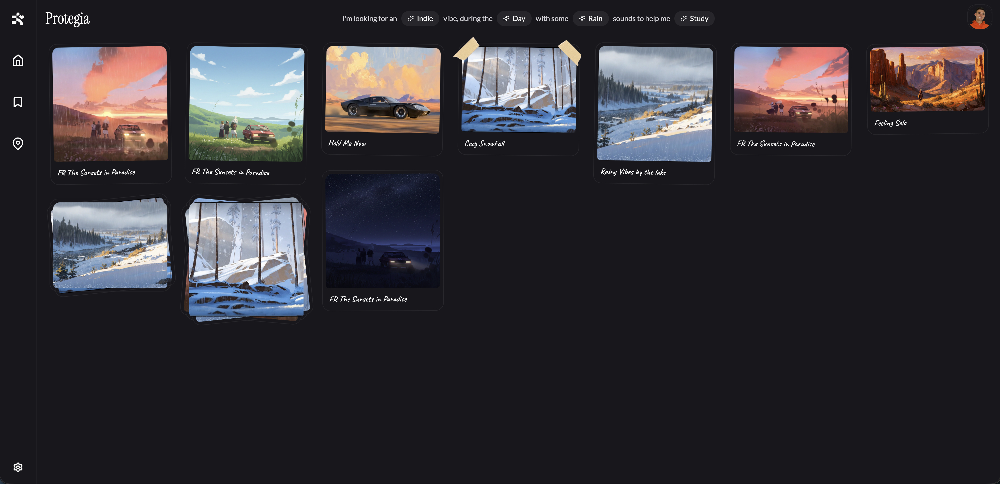
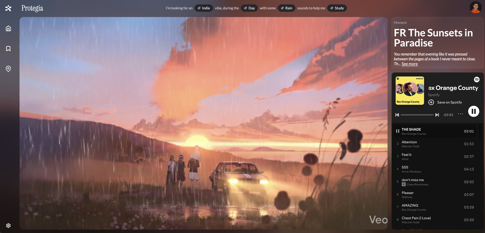
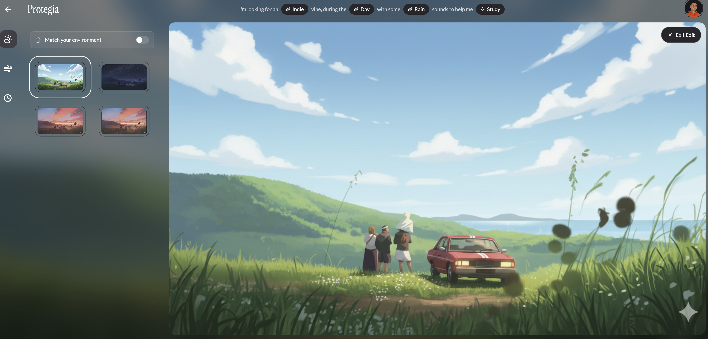

# 🍃 Protegia.io

[Protegia](https://protegia.io/) invites users to step into a fictional world where story is experienced, not rushed. Through short narrative beats, atmospheric soundscapes, and visual moments, it offers a calm, reflective alternative to traditional content feeds. Protegia is a story you consume—and a world that only opens to those willing to slow down, reflect, and move forward.

---

### Core Capabilities

- **Customizable space** — backgrounds, weather, time of day, and theming that personalize the environment.
- **Widget system** — modular widgets (clock, notes, quotes, timer, weather) you can add, arrange, and remove via drag-and-drop.
- **Live weather + environment matching** — the scene responds to time of day and the user's real weather.
- **Music & ambient audio** — persistent music player with Spotify integration and layered soundscapes.
- **Map / world exploration** — an explorable Protegia world.
- **Accounts & onboarding** — authentication plus a guided onboarding flow, with preferences and favorites that persist across sessions.

---

## Infrastructure & Tech Stack

Protegia is a React + TypeScript single-page app built in VScode deployed on Netlify, with a Supabase backend.

### Frontend

| Layer | Technology |
|-------|-----------|
| Framework | React 18 + TypeScript |
| Build tool | Vite 6 (with `@tailwindcss/vite`) |
| Styling | Tailwind CSS v4 |
| UI components | shadcn/ui (Radix primitives) + MUI Material |
| Routing | wouter |
| State | React Context (`AuthContext`, `PreferencesContext`) |
| Animation | Framer Motion / Motion |
| Drag & drop | react-dnd (HTML5 backend) |
| 3D / map | three.js + React Three Fiber (`@react-three/fiber`, `drei`, `postprocessing`); a parallel Unity map prototype lives in `/unity` |
| Charts | Recharts |
| AI | Google Generative AI SDK (`@google/generative-ai`) |

### Backend & Platform

| Layer | Technology |
|-------|-----------|
| Auth & data | Supabase (auth, edge functions, KV store) |
| Edge functions | Deno runtime (`supabase/functions/make-server-b8271a5d/`) |
| Analytics | Mixpanel (`mixpanel-browser`) |
| Deployment | Netlify |
| Component dev | Storybook |

---

## Screenshots

> Drop images into `docs/screenshots/` using the filenames below and they'll render automatically.

### Home / Space

### In Space

### Widgets

